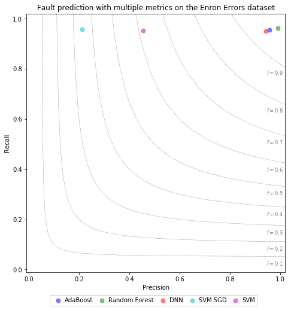
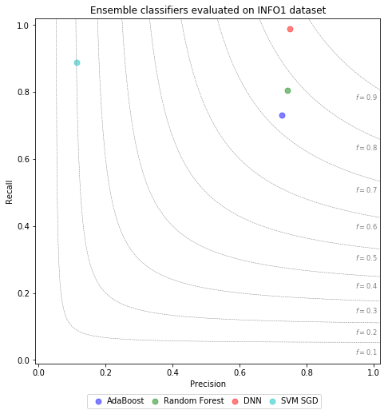
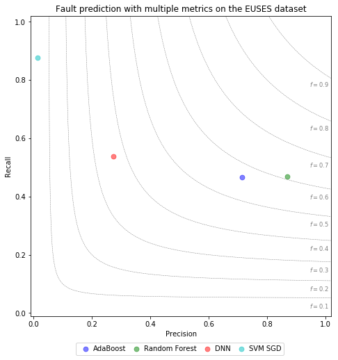
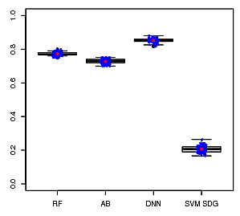
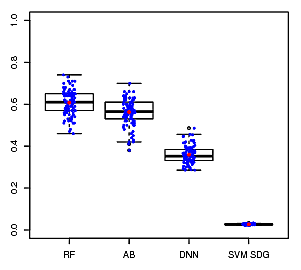

<h2>Study 2: Fault prediction with multiple metrics</h2>
  
ML models that use all metrics of the catalog trained and evaluated on the three datasets (Enron Erros, Info1, Euses) 

  <h3>  Precision / Recall / F1 plots </h3>
    
Visual comparison of average prediction results measured in precision/recall/F1-score </h3>
    

    

    

  <h3>  Boxplots </h3>
    
Distribution of measured F1 results of different models on the three datasets in order: Enron Errors, INFO1, and EUSES.

    

    

    

